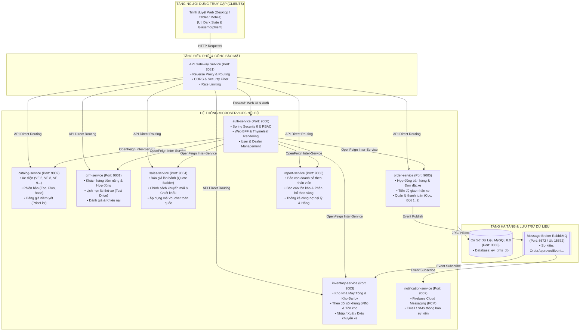
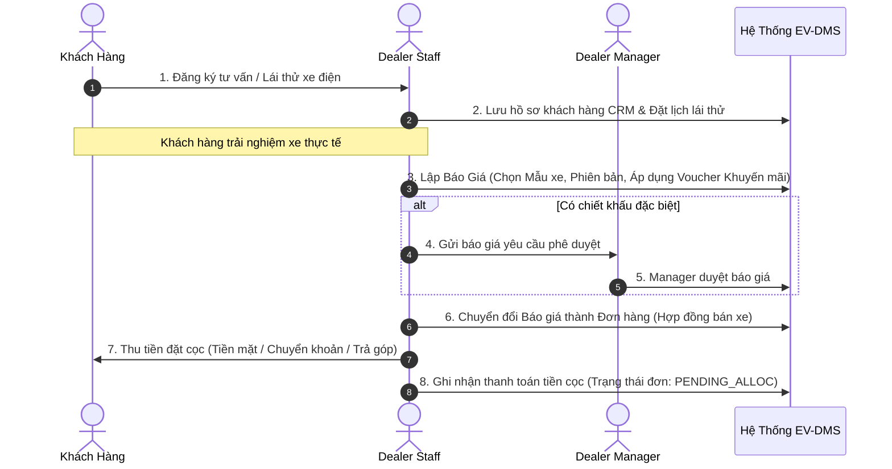
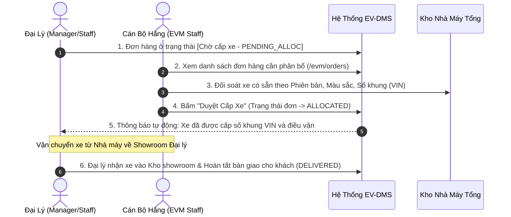

# ⚡ EV-DMS • Electric Vehicle Dealer Management System
> **Phần Mềm Quản Lý Bán Xe Điện Thông Qua Kênh Đại Lý Ủy Quyền**  
> Kiến trúc Microservices phân tán hiện đại xây dựng trên nền tảng **Spring Boot 3.2**, **Spring Cloud 2023**, **Docker**, **MySQL**, **RabbitMQ** và giao diện **Thymeleaf Dark Slate & Glassmorphism**.

---

## 📑 MỤC LỤC
1. [Giới Thiệu Tổng Quan](#1-giới-thiệu-tổng-quan)
2. [Kiến Trúc Hệ Thống (System Architecture)](#2-kiến-trúc-hệ-thống-system-architecture)
3. [Phân Tích 4 Nhóm Người Dùng (Actors & Permissions)](#3-phân-tích-4-nhóm-người-dùng-actors--permissions)
4. [Quy Trình Nghiệp Vụ Cốt Lõi (Core Business Workflows)](#4-quy-trình-nghiệp-vụ-cốt-lõi-core-business-workflows)
5. [Cấu Trúc Các Microservices (Modules Breakdown)](#5-cấu-trúc-các-microservices-modules-breakdown)
6. [Giao Diện Đột Phá (Modern Glassmorphism UI/UX)](#6-giao-diện-đột-phá-modern-glassmorphism-uiux)
7. [Bản Đồ Đường Dẫn Hệ Thống (Route & Screen Matrix)](#7-bản-đồ-đường-dẫn-hệ-thống-route--screen-matrix)
8. [Tài Khoản Thử Nghiệm Nhanh (Demo Accounts)](#8-tài-khoản-thử-nghiệm-nhanh-demo-accounts)
9. [Hướng Dẫn Cài Đặt & Khởi Chạy (Step-by-Step Setup)](#9-hướng-dẫn-cài-đặt--khởi-chạy-step-by-step-setup)

---

## 1. GIỚI THIỆU TỔNG QUAN

**EV-DMS (Electric Vehicle Dealer Management System)** là giải pháp phần mềm quản trị chuỗi cung ứng và phân phối xe điện đa tầng, kết nối trực tiếp giữa **Hãng sản xuất xe điện (EVM - Electric Vehicle Manufacturer)** và **Hệ thống Showroom / Đại lý 3S - 4S ủy quyền** trên toàn quốc.

### Mục tiêu cốt lõi:
- **Chuẩn hóa quy trình bán hàng**: Từ tiếp cận khách hàng tiềm năng, đặt lịch lái thử, lập báo giá lăn bánh, áp dụng voucher khuyến mãi đến ký hợp đồng bán lẻ và quản lý thanh toán tiền cọc (trả thẳng / trả góp).
- **Tối ưu hóa chuỗi cung ứng & phân phối**: Đại lý gửi yêu cầu đặt xe, Hãng kiểm tra tồn kho nhà máy xuất xưởng, duyệt cấp số khung (VIN) và điều vận xe đến tận showroom.
- **Giám sát thời gian thực (Real-time Analytics)**: Quản lý công nợ, hiệu suất bán hàng của từng nhân viên tư vấn, tồn kho theo từng chi nhánh và báo cáo doanh thu toàn quốc.

---

## 2. KIẾN TRÚC HỆ THỐNG (SYSTEM ARCHITECTURE)

Hệ thống được thiết kế theo mô hình **Microservices Kiến Trúc Hướng Sự Kiện (Event-Driven Microservices Architecture)**, đảm bảo khả năng mở rộng độc lập, tính sẵn sàng cao và dễ dàng bảo trì.



---

## 3. PHÂN TÍCH 4 NHÓM NGƯỜI DÙNG (ACTORS & PERMISSIONS)

Hệ thống phân quyền nghiêm ngặt dựa trên vai trò (Role-Based Access Control - RBAC):

| STT | Vai Trò (Actor) | Phạm Vi Quyền Hạn | Trách Nhiệm & Chức Năng Chính |
|:---:|:---|:---|:---|
| **1** | **Quản Trị Viên (Admin)** | Toàn hệ thống | • Quản lý mạng lưới showroom/đại lý toàn quốc (`/admin/dealers`).<br>• Cấp phát, khóa tài khoản và phân quyền người dùng (`/admin/user-mgmt`).<br>• Cấu hình danh mục xe, phiên bản và bảng giá gốc.<br>• Giám sát hệ thống và cấu hình tham số toàn cục. |
| **2** | **Giám Đốc Đại Lý (Dealer Manager)** | Phạm vi Đại lý phụ trách | • Điều hành hoạt động showroom (`/dealer/home`).<br>• Phê duyệt các bản báo giá có ưu đãi đặc biệt từ nhân viên (`/dealer/quotes/pending`).<br>• Quản lý tất cả đơn hàng bán lẻ và đơn đặt xe từ hãng (`/dealer/orders`).<br>• Giám sát kho xe đại lý (`/dealer/inventory`) và phân công lịch lái thử (`/dealer/test-drive`).<br>• Theo dõi doanh số nhân viên kinh doanh & báo cáo doanh thu showroom (`/reports/sale`). |
| **3** | **Nhân Viên Bán Hàng (Dealer Staff)** | Phạm vi khách hàng của mình | • Bàn làm việc tư vấn viên (`/staff/dashboard`).<br>• Tạo và xuất báo giá lăn bánh cho khách (`/dealer/quotes/my/new`).<br>• Tạo hợp đồng bán hàng, theo dõi đơn hàng của tôi (`/dealer/orders/my`).<br>• Tiếp nhận và hướng dẫn khách hàng lái thử xe điện (`/dealer/test-drive`).<br>• Quản lý hồ sơ thông tin khách hàng CRM (`/dealer/customers`). |
| **4** | **Cán Bộ Hãng Xe (EVM Staff)** | Phạm vi Hãng sản xuất | • Trung tâm điều hành chuỗi cung ứng Hãng (`/evm/dashboard`).<br>• Tiếp nhận đơn đặt xe từ các đại lý và **Duyệt phân bổ số khung (VIN)** xuất xưởng (`/evm/orders`).<br>• Quản lý kho xe tổng tại nhà máy sản xuất (`/evm/inventory`).<br>• Ban hành các chiến dịch khuyến mãi toàn quốc (`/evm/promotions`).<br>• Quản lý danh mục kỹ thuật các dòng xe điện (`/evm/products`). |

---

## 4. QUY TRÌNH NGHIỆP VỤ CỐT LÕI (CORE BUSINESS WORKFLOWS)

### A. Quy Trình Bán Hàng & Tạo Hợp Đồng (Sales Flow)


---

### B. Quy Trình Phân Bổ Xe Từ Kho Nhà Máy Hãng (Vehicle Supply Chain Flow)


---

## 5. CẤU TRÚC CÁC MICROSERVICES (MODULES BREAKDOWN)

Dự án gồm **10 modules Maven** kết nối chặt chẽ:

| STT | Tên Module | Cổng (Port) | Công Nghệ / Thư Viện Chính | Vai Trò Chuyên Biệt |
|:---:|:---|:---:|:---|:---|
| 1 | `gateway-service` | **8081** | Spring Cloud Gateway, Reactive WebFlux | Cổng truy cập duy nhất, định tuyến URL, cân bằng tải. |
| 2 | `auth-service` | **9000** | Spring Security 6, Thymeleaf, Feign, JPA | Xác thực người dùng, Web BFF, giao diện Dark Glassmorphism. |
| 3 | `catalog-service` | **9002** | Spring Boot Web, Spring Data JPA | Quản lý dòng xe (Vehicle), phiên bản (Trim), bảng giá (PriceList). |
| 4 | `crm_service` | **9001** | Spring Boot Web, Spring Data JPA | Hồ sơ khách hàng (Customer), lịch lái thử (TestDrive). |
| 5 | `inventory-service`| **9003** | Spring Boot Web, Spring Data JPA | Tồn kho xe (Inventory), định danh số VIN, lịch sử điều chuyển xe. |
| 6 | `sales-service` | **9004** | Spring Boot Web, Spring Data JPA | Báo giá (Quote), chương trình ưu đãi & voucher (Promotion). |
| 7 | `order-service` | **9005** | Spring Boot Web, RabbitMQ, Feign | Đơn hàng (OrderHdr), chi tiết đơn (OrderItem), thanh toán (Payment). |
| 8 | `report-service` | **9006** | Spring Boot Web, Spring Data JPA | Báo cáo phân tích doanh thu, sản lượng bán, công nợ chi nhánh. |
| 9 | `notification-service`| **9007** | Spring Boot Web, Firebase Admin SDK | Thông báo đẩy Push Notifications & Email tự động. |
| 10 | `ev-dms-microservices`| - | Maven Parent POM | Quản lý phiên bản dependencies tập trung (Spring Boot 3.2.5). |

---

## 6. GIAO DIỆN ĐỘT PHÁ (MODERN GLASSMORPHISM UI/UX)

Hệ thống giao diện được nâng cấp toàn diện theo chuẩn thiết kế **Dark Slate & Glassmorphism cao cấp**:

- **Nền Không Gian Đa Tầng**: Phối hợp giữa các gam màu tối Slate (`#0b0f19`, `#0f172a`) và lưới phát quang Radial Mesh Neon, mang lại cảm giác công nghệ tương lai.
- **Thẻ Kính Mờ (Glass Cards)**: Sử dụng hiệu ứng `backdrop-filter: blur(16px)` kết hợp đường viền mỏng trong suốt `rgba(255, 255, 255, 0.08)`.
- **Thống Kê Phát Sáng (Glowing KPI Cards)**: Chỉ số kinh doanh nổi bật với các icon công nghệ xe điện phát quang.
- **Thanh Điều Hướng Thông Minh (Dynamic Sidebar Router)**: Tự động tải đúng menu tính năng riêng biệt cho từng vai trò thông qua Spring Security `sec:authorize`.
- **Trang Đăng Nhập Đột Phá (1-Click Quick Demo Switcher)**:
  - Thiết kế 2 cột chuẩn mực.
  - Tích hợp sẵn 4 thẻ đăng nhập mẫu: Chỉ cần click chuột vào thẻ (Admin / Manager / Staff / EVM) là thông tin tài khoản tự động được điền và sẵn sàng đăng nhập ngay lập tức.

---

## 7. BẢN ĐỒ ĐƯỜNG DẪN HỆ THỐNG (ROUTE & SCREEN MATRIX)

Tất cả các route dưới đây đã được kiểm thử tự động đạt **HTTP 200 OK**:

### 🛡️ Quản Trị Viên (Admin)
- `/admin/dashboard` : Bàn điều khiển trung tâm quản trị tối cao.
- `/admin/dealers` : Mạng lưới showroom & đại lý 3S/4S toàn quốc.
- `/admin/dealers/create` : Thêm mới đại lý ủy quyền.
- `/admin/user-mgmt` : Danh sách tài khoản người dùng & phân quyền.
- `/admin/user-mgmt/new` : Khởi tạo tài khoản nhân viên / quản lý mới.
- `/dealer/vehicles` : Catalog xe điện và cấu hình thông số kỹ thuật.

### 🏢 Giám Đốc Đại Lý (Dealer Manager)
- `/dealer/home` : Bàn làm việc điều hành hoạt động showroom đại lý.
- `/dealer/orders` : Quản lý danh sách đơn hàng & hợp đồng của showroom.
- `/dealer/quotes/pending` : Danh sách các báo giá đang chờ Manager phê duyệt.
- `/dealer/inventory` : Quản lý số lượng và số khung xe tồn kho tại đại lý.
- `/dealer/customers` : Quản lý danh bạ khách hàng CRM của đại lý.
- `/dealer/test-drive` : Điều phối và duyệt lịch hẹn lái thử trải nghiệm.
- `/manager/users` : Quản lý đội ngũ nhân viên kinh doanh của showroom.
- `/manager/promotions` : Danh sách các chương trình khuyến mãi đang áp dụng.
- `/reports/sale` : Báo cáo doanh số và sản lượng bán lẻ của đại lý.

### 💼 Nhân Viên Bán Hàng (Dealer Staff)
- `/staff/dashboard` : Bàn làm việc cá nhân (Xe hot, Khách mới, Lịch lái thử hôm nay).
- `/dealer/quotes/my/new` : Công cụ lập báo giá mới, áp dụng voucher cho khách.
- `/dealer/quotes/my` : Danh sách các báo giá do mình tạo.
- `/dealer/orders/my` : Danh sách đơn hàng bán lẻ do mình trực tiếp phụ trách.
- `/dealer/vehicles` : Tra cứu bảng giá niêm yết và thông số kỹ thuật xe.
- `/dealer/customers` : Khách hàng tiềm năng do nhân viên quản lý.
- `/dealer/test-drive` : Lịch hẹn lái thử được giao nhiệm vụ đồng hành.

### 🏭 Cán Bộ Hãng Xe (EVM Staff)
- `/evm/dashboard` : Trung tâm điều phối chuỗi cung ứng Hãng xe toàn quốc.
- `/evm/orders` : Danh sách đơn đặt xe từ các đại lý & nút **Phê duyệt cấp xe (Allocate)**.
- `/evm/inventory` : Giám sát tồn kho thành phẩm tại Kho Tổng Nhà Máy.
- `/evm/products` : Quản lý các dòng xe điện (Model) và phiên bản (Trim).
- `/evm/promotions` : Ban hành các chiến dịch ưu đãi, giảm giá toàn quốc.
- `/reports` : Báo cáo tổng hợp chuỗi cung ứng theo khu vực.

---

## 8. TÀI KHOẢN THỬ NGHIỆM NHANH (DEMO ACCOUNTS)

Hệ thống đã được nạp sẵn dữ liệu mẫu (Seeded Data). Mật khẩu dùng chung cho tất cả tài khoản là **`123456`**:

| Vai Trò | Tên Đăng Nhập | Mật Khẩu | Đơn Vị Phụ Trách | Mục Đích Thử Nghiệm |
|:---|:---:|:---:|:---|:---|
| **System Admin** | `admin` | `123456` | Trụ sở chính EV-DMS | Quản trị đại lý, tài khoản, cấu hình hệ thống |
| **Dealer Manager** | `manager1` | `123456` | Đại lý VinFast Thăng Long | Điều hành showroom, duyệt báo giá, quản lý kho |
| **Dealer Staff** | `staff1` | `123456` | Đại lý VinFast Thăng Long | Tư vấn bán hàng, tạo báo giá, đặt lịch lái thử |
| **EVM Staff** | `evm1` | `123456` | Nhà máy sản xuất EVM | Duyệt cấp xe từ nhà máy cho đại lý, khuyến mãi |

---

## 9. HƯỚNG DẪN CÀI ĐẶT & KHỞI CHẠY (STEP-BY-STEP SETUP)

### A. Yêu Cầu Môi Trường
- **Hệ điều hành**: Windows 10/11, macOS, hoặc Linux.
- **Java SDK**: Java 17 (khuyến nghị JDK 17.0.12).
- **Cơ sở dữ liệu**: Docker Desktop (chạy MySQL 8 và RabbitMQ).
- **Trình biên dịch**: Apache Maven 3.9+.

### B. Bước 1: Khởi động Cơ sở dữ liệu & Message Broker
Tại thư mục gốc dự án (`C:\EV-DMS`), mở terminal và chạy:
```bash
docker compose up -d evdms-db
```
*(MySQL chạy trên cổng `3308` với tài khoản `root` / mật khẩu `root`, database tự tạo `ev_dms_db`).*

### C. Bước 2: Biên Dịch & Đóng Gói Toàn Bộ Hệ Thống
Chạy lệnh đóng gói:
```bash
mvn clean package -DskipTests
```

### D. Bước 3: Khởi Chạy Ứng Dụng
1. **Khởi chạy Auth & Web UI Service (Port 9000):**
```powershell
& "C:\Java\jdk-17.0.12\bin\java.exe" -jar auth-service\target\auth-service-1.0.0-SNAPSHOT.jar
```
*(Dữ liệu mẫu gồm các tài khoản, dòng xe VF 5, VF 8, VF 9, kho xe, đơn hàng và khách hàng sẽ tự động được khởi tạo vào MySQL).*

2. **Khởi chạy API Gateway (Port 8081 - Tùy chọn khi chạy cụm microservices):**
```powershell
& "C:\Java\jdk-17.0.12\bin\java.exe" -jar gateway-service\target\gateway-service-1.0.0-SNAPSHOT.jar
```

### E. Bước 4: Truy Cập & Trải Nghiệm
1. Mở trình duyệt web và truy cập: **`http://localhost:9000/login`** (hoặc qua Gateway **`http://localhost:8081/login`**).
2. Nhấp vào 1 trong 4 thẻ Demo tài khoản ở cột bên trái (Admin / Dealer Manager / Dealer Staff / EVM Staff).
3. Bấm nút **"Đăng nhập hệ thống"** để trải nghiệm giao diện Dark Glassmorphism công nghệ cao!

---

## 10. BẢN QUYỀN & PHÁT TRIỂN
- **Dự án**: Electric Vehicle Dealer Management System (EV-DMS)
- **Phiên bản**: v2.5 Enterprise Edition
- **Công nghệ**: Spring Boot 3.2.5 • Spring Cloud 2023.0.3 • Thymeleaf Modern Glassmorphism
